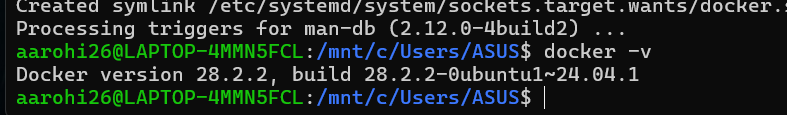
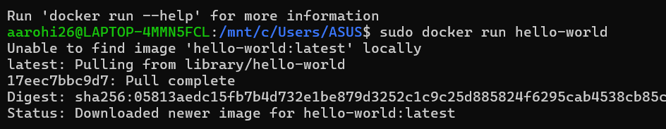
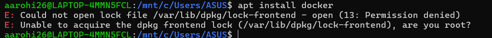
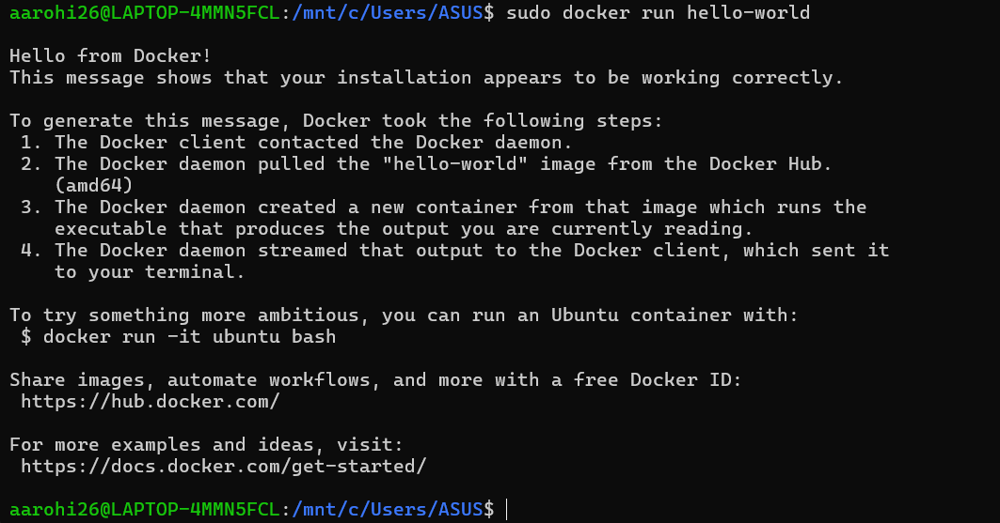
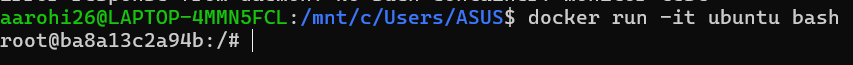

# 🐳 Docker Installation and Verification (Experiment)

## 🎯 Objective
To install Docker, verify its version, handle permission issues, and run a test container to ensure Docker is working correctly.

## 🛠️ Step 1: Verify Docker Installation
```bash
Command:
docker -v
```
Output:

Inference:
Docker is successfully installed on the system.

## 🚀 Step 2: Run Hello World Container
```bash
Command:
sudo docker run hello-world
```

Process:
- Docker checks for the image locally
- If not found, it pulls from Docker Hub
- Creates and runs the container

Output:


Inference:
- Docker daemon is running properly
- Image pulling is successful
- Container execution is successful

## ⚠️ Step 3: Permission Error Encountered
```bash
Command:
apt install docker
```

Error:
Could not open lock file /var/lib/dpkg/lock-frontend - open (13: Permission denied)
Unable to acquire the dpkg frontend lock, are you root?

Reason:
The command requires root (administrator) privileges.

Solution:
sudo apt install docker

## 📦 Step 4: Internal Working of Docker (Hello-World)
When the command is executed, Docker performs the following:
1. Docker client contacts the Docker daemon
2. The daemon pulls the "hello-world" image from Docker Hub
3. A container is created from the image
4. The container runs and produces output
5. Output is displayed on the terminal


## 🧪 Additional Command
To run an interactive Ubuntu container:
docker run -it ubuntu bash


## ✅ Conclusion
Docker has been successfully installed and verified. The Hello World container confirms that Docker is functioning correctly, including pulling images and running containers. Permission issues were identified and resolved using sudo privileges.

## 📌 Result
Docker setup is complete and working correctly on the system.