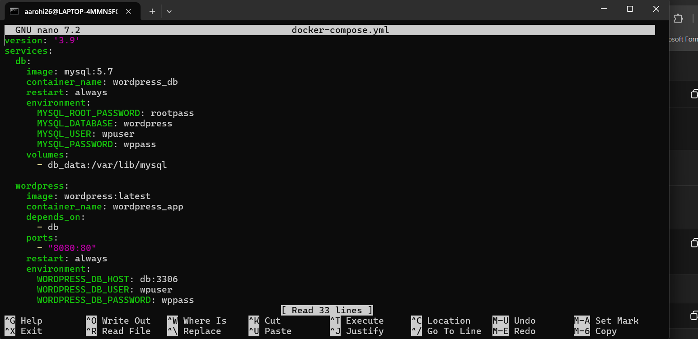
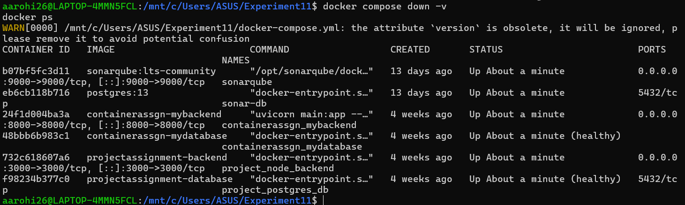
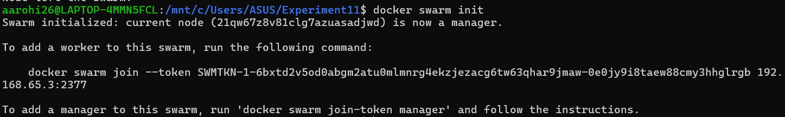
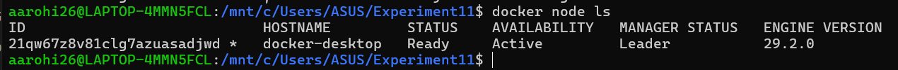
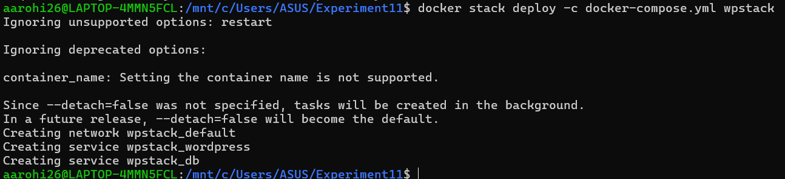
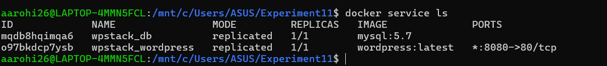
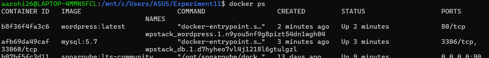

# Experiment 11: Orchestration using Docker Compose & Docker Swarm (Continuation of Experiment 6)

## PART A – CONCEPT CONTINUATION (Simple Explanation)
From Experiment 6, docker run runs a single container but requires manual handling and has no coordination, while Docker Compose runs multiple containers together but only on a single machine and without auto-healing. The new concept is orchestration, which means automatic management of containers including scaling (increase/decrease containers), self-healing (restart failed containers), load balancing (distribute traffic), and multi-host deployment. The progression path is: docker run → Docker Compose → Docker Swarm → Kubernetes. This experiment focuses on moving from Compose to Swarm.

## PART B – PRACTICAL (EXTENSION OF EXPERIMENT 6)

### Prerequisites
- Docker installed with Swarm enabled
- docker-compose.yml file (WordPress + MySQL)

```yaml
version: '3.9'
services:
  db:
    image: mysql:5.7
    container_name: wordpress_db
    restart: always
    environment:
      MYSQL_ROOT_PASSWORD: rootpass
      MYSQL_DATABASE: wordpress
      MYSQL_USER: wpuser
      MYSQL_PASSWORD: wppass
    volumes:
      - db_data:/var/lib/mysql
  wordpress:
    image: wordpress:latest
    container_name: wordpress_app
    depends_on:
      - db
    ports:
      - "8080:80"
    restart: always
    environment:
      WORDPRESS_DB_HOST: db:3306
      WORDPRESS_DB_USER: wpuser
      WORDPRESS_DB_PASSWORD: wppass
      WORDPRESS_DB_NAME: wordpress
    volumes:
      - wp_data:/var/www/html
volumes:
  db_data:
  wp_data:
```



### Task 1: Check Current State
```bash
docker compose down -v
docker ps
```


### Task 2: Initialize Docker Swarm
```bash
docker swarm init
```

```bash
docker node ls
```


### Task 3: Deploy as a Stack
```bash
docker stack deploy -c docker-compose.yml wpstack
```


### Task 4: Verify Deployment
```bash
docker service ls
```

```bash
docker service ps wpstack_wordpress
```

```bash
docker ps
```


### Task 5: Access WordPress
Open in browser:
http://localhost:8080

### Task 6: Scale the Application
```bash
docker service scale wpstack_wordpress=3
docker service ls
docker service ps wpstack_wordpress
docker ps | grep wordpress
```

### Task 7: Test Self-Healing
```bash
docker ps | grep wordpress
docker kill <container-id>
docker service ps wpstack_wordpress
docker ps | grep wordpress
```

### Task 8: Remove the Stack
```bash
docker stack rm wpstack
docker service ls
docker ps
```

## PART C – ANALYSIS (Compose vs Swarm)
Docker Compose works on a single host with manual recovery and limited scaling. Docker Swarm supports multi-node clusters, automatic scaling, load balancing, and self-healing. Compose is best for development/testing, while Swarm is suitable for small production.

## PART D – IMPORTANT OBSERVATIONS
- Same YAML file works for both Compose and Swarm  
- docker compose up -d → Compose mode  
- docker stack deploy → Swarm mode  
- Swarm manages services, not containers  
- Built-in load balancer avoids port conflicts  

## PART E – LEARNING OUTCOME CHECK
- Why is Compose not enough for production?  
- Difference between docker compose up and docker stack deploy  
- How does Swarm achieve self-healing?  
- What happens when a container is killed?  
- Can the same Compose file be reused?  

## PART F – OPTIONAL: Multi-Node Swarm
```bash
docker swarm join-token worker
docker swarm join --token <token> <manager-ip>:2377
docker node ls
```

## SUMMARY
You progressed from single containers to multi-container applications and now to orchestration using Docker Swarm. You learned scaling, self-healing, and load balancing. Compose defines the application, Swarm runs it reliably.

## QUICK REFERENCE COMMANDS
```bash
docker swarm init
docker stack deploy -c docker-compose.yml <stack-name>
docker service ls
docker service scale <stack-name_service-name>=<replicas>
docker service ps <service-name>
docker stack rm <stack-name>
docker swarm leave --force
```