# 📘 Experiment 12: Study and Analyse Container Orchestration using Kubernetes

## 🎯 Objective
Learn why Kubernetes is used, understand its core concepts, and perform deployment, scaling, and self-healing using Kubernetes commands.

## 🚀 Why Kubernetes over Docker Swarm?
- Industry Standard → Widely used in companies  
- Powerful Scheduling → Automatically assigns workloads  
- Large Ecosystem → Supports many tools and plugins  
- Cloud-Native → Works with AWS, GCP, Azure  

## 🧠 Core Kubernetes Concepts
- Container → Pod (smallest unit in Kubernetes)  
- Compose Service → Deployment (defines how app runs)  
- Load Balancing → Service (exposes app)  
- Scaling → ReplicaSet (maintains pod count)  

## 🧪 Hands-On Lab (k3d / Minikube)
Assumption: `kubectl` and cluster already installed  
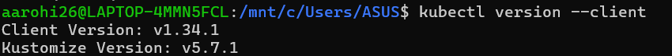

## 🔹 Task 1: Create Deployment
Create `wordpress-deployment.yaml`
apiVersion: apps/v1  
kind: Deployment  
metadata:  
  name: wordpress  
spec:  
  replicas: 2  
  selector:  
    matchLabels:  
      app: wordpress  
  template:  
    metadata:  
      labels:  
        app: wordpress  
    spec:  
      containers:  
      - name: wordpress  
        image: wordpress:latest  
        ports:  
        - containerPort: 80  

▶ Apply:
`kubectl apply -f wordpress-deployment.yaml`
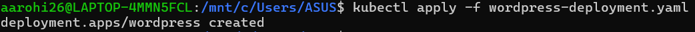

## 🔹 Task 2: Expose as Service
Create `wordpress-service.yaml`
apiVersion: v1  
kind: Service  
metadata:  
  name: wordpress-service  
spec:  
  type: NodePort  
  selector:  
    app: wordpress  
  ports:  
    - port: 80  
      targetPort: 80  
      nodePort: 30007  

▶ Apply:
`kubectl apply -f wordpress-service.yaml`
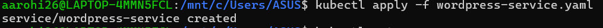

## 🔹 Task 3: Verify
▶ Check pods:
`kubectl get pods`
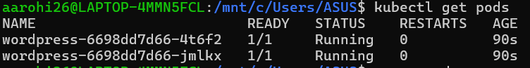

▶ Check service:
`kubectl get svc`
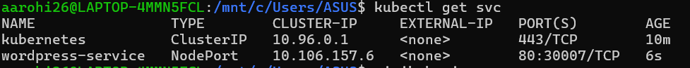

▶ Access:
`http://<node-ip>:30007`
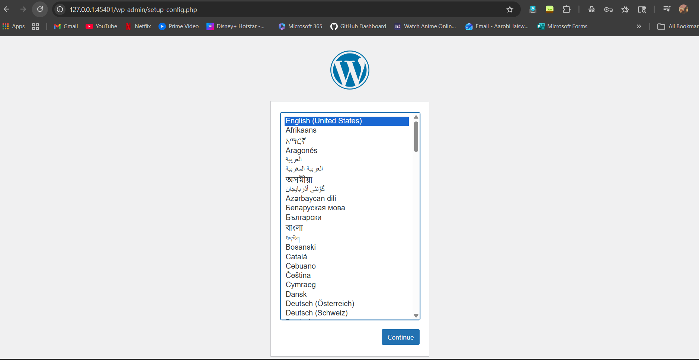

▶ Get IP:
`minikube ip`
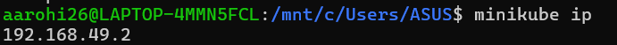

## 🔹 Task 4: Scale Deployment
▶ Scale:
`kubectl scale deployment wordpress --replicas=4`
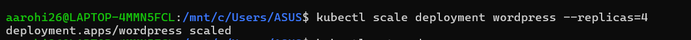
▶ Verify:
`kubectl get pods`
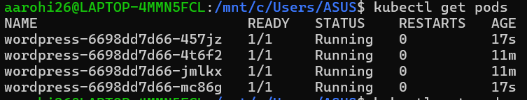

## 🔹 Task 5: Self-Healing
▶ Commands:
`kubectl get pods`  
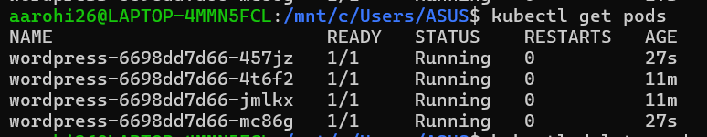

`kubectl delete pod <pod-name>`  

`kubectl get pods`
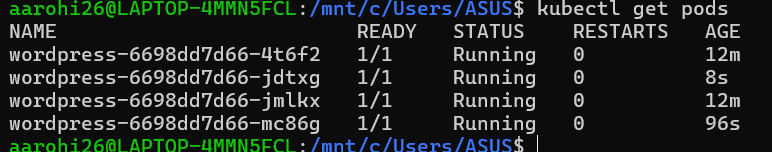

## ⚖️ Swarm vs Kubernetes
- Swarm → Easy but limited  
- Kubernetes → Advanced and industry standard  

## 🏗️ Advanced Lab (kubeadm)

### Install Tools
`sudo apt update`  
`sudo apt install -y apt-transport-https ca-certificates curl`  

`curl -fsSL https://pkgs.k8s.io/core:/stable:/v1.29/deb/Release.key | sudo gpg --dearmor -o /etc/apt/keyrings/kubernetes-apt-keyring.gpg`  

`echo 'deb [signed-by=/etc/apt/keyrings/kubernetes-apt-keyring.gpg] https://pkgs.k8s.io/core:/stable:/v1.29/deb/ /' | sudo tee /etc/apt/sources.list.d/kubernetes.list`  

`sudo apt update`  
`sudo apt install -y kubeadm kubelet kubectl`  
`sudo apt-mark hold kubeadm kubelet kubectl`  

### Initialize Master
`sudo kubeadm init`

### Configure kubectl
`mkdir -p $HOME/.kube`  
`sudo cp /etc/kubernetes/admin.conf $HOME/.kube/config`  
`sudo chown $(id -u):$(id -g) $HOME/.kube/config`

### Install Network Plugin
`kubectl apply -f https://docs.projectcalico.org/manifests/calico.yaml`

### Join Worker Nodes
`kubeadm join <ip>:6443 --token <token> --discovery-token-ca-cert-hash sha256:<hash>`

### Verify Cluster
`kubectl get nodes`

## 🧠 Tool Usage
- k3d → Quick learning  
- Minikube → Local testing  
- kubeadm → Production setup  

## 📌 Cheat Sheet
`kubectl apply -f file.yaml`  
`kubectl get pods`  
`kubectl get svc`  
`kubectl scale deployment <name> --replicas=N`  
`kubectl delete pod <pod-name>`  
`kubectl get nodes`

## ✅ Conclusion
- Learned Kubernetes basics  
- Deployed WordPress  
- Performed scaling  
- Tested self-healing  
- Understood real cluster setup  

👉 Next: Deploy your own app