# Lab Experiment 7: CI/CD Pipeline using Jenkins, GitHub & Docker Hub

## Aim
Design and implement a complete CI/CD pipeline using Jenkins, integrating source code from GitHub, and building & pushing Docker images to Docker Hub.

---

## Objectives
- Understand CI/CD workflow using Jenkins (GUI-based automation server)
- Create a structured GitHub repository containing application code and a `Jenkinsfile`
- Build Docker images from source code automatically
- Securely store Docker Hub credentials inside Jenkins
- Automate build & push using GitHub Webhook triggers
- Use the same Docker host as the Jenkins agent

---

## Tech Stack

| Tool | Role |
|------|------|
| Jenkins | CI/CD automation server |
| GitHub | Source code + pipeline definition host |
| Docker | Build & package application |
| Docker Hub | Container image registry |
| Webhook | Trigger automation on code push |

---

## Workflow Overview

```
Developer → GitHub Push → Webhook → Jenkins → Docker Build → Docker Hub
```

---

## Project Structure

```
my-app/
├── app.py              # Flask web application
├── requirements.txt    # Python dependencies
├── Dockerfile          # Image build instructions
└── Jenkinsfile         # Pipeline definition
```

---

## Setup Guide

### Part A: GitHub Repository

**1. Application Code (`app.py`)**
```python
from flask import Flask
app = Flask(__name__)

@app.route("/")
def home():
    return "Hello from CI/CD Pipeline!"

app.run(host="0.0.0.0", port=80)
```
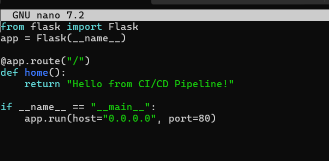
**2. Dependencies (`requirements.txt`)**
```
flask
```
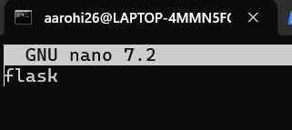

**3. Dockerfile**
```dockerfile
FROM python:3.10-slim

WORKDIR /app
COPY . .

RUN pip install -r requirements.txt

EXPOSE 80
CMD ["python", "app.py"]
```
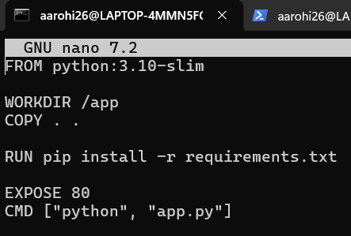

**4. Jenkinsfile**
```groovy
pipeline {
    agent any

    environment {
        IMAGE_NAME = "your-dockerhub-username/myapp"
    }

    stages {

        stage('Clone Source') {
            steps {
                git 'https://github.com/your-username/my-app.git'
            }
        }

        stage('Build Docker Image') {
            steps {
                sh 'docker build -t $IMAGE_NAME:latest .'
            }
        }

        stage('Login to Docker Hub') {
            steps {
                withCredentials([string(credentialsId: 'dockerhub-token', variable: 'DOCKER_TOKEN')]) {
                    sh 'echo $DOCKER_TOKEN | docker login -u your-dockerhub-username --password-stdin'
                }
            }
        }

        stage('Push to Docker Hub') {
            steps {
                sh 'docker push $IMAGE_NAME:latest'
            }
        }
    }
}
```
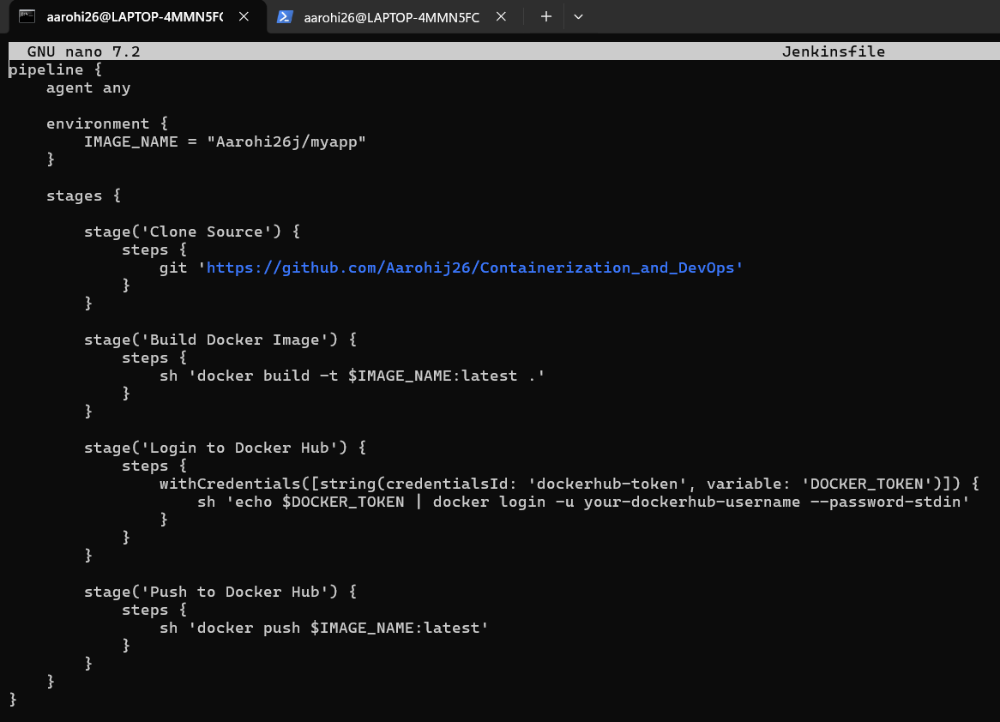
---

### Part B: Jenkins Setup (via Docker Compose)

**`docker-compose.yml`**
```yaml
version: '3.8'

services:
  jenkins:
    image: jenkins/jenkins:lts
    container_name: jenkins
    restart: always
    ports:
      - "8080:8080"
      - "50000:50000"
    volumes:
      - jenkins_home:/var/jenkins_home
      - /var/run/docker.sock:/var/run/docker.sock
    user: root

volumes:
  jenkins_home:
```
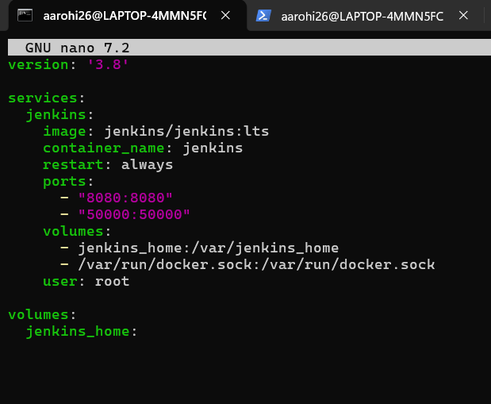

**Start Jenkins:**
```bash
docker-compose up -d
```

**Access Jenkins:** `http://localhost:8080`
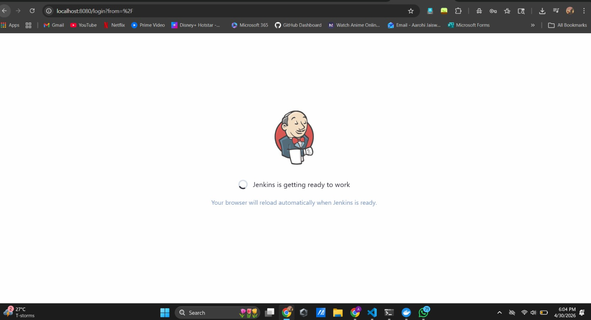

**Get initial admin password:**
```bash
docker exec -it jenkins cat /var/jenkins_home/secrets/initialAdminPassword
```
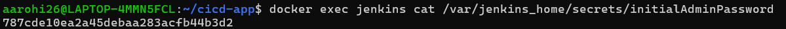
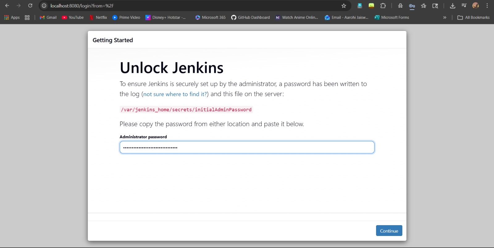

After unlocking: install suggested plugins and create an admin user.
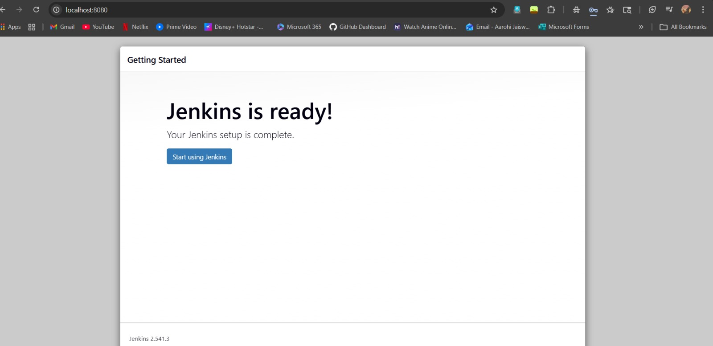
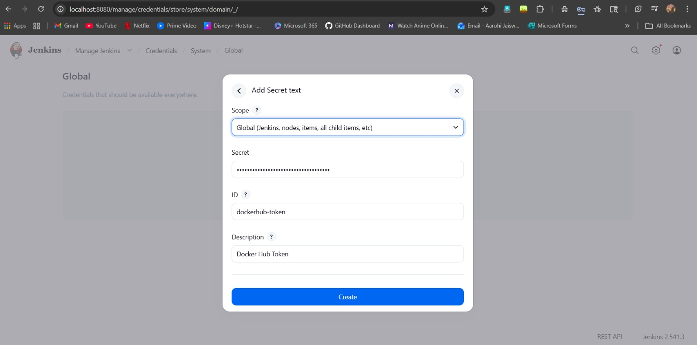
---

### Part C: Jenkins Configuration

**1. Add Docker Hub Credentials**
```
Manage Jenkins → Credentials → Add Credentials
  Type:  Secret Text
  ID:    dockerhub-token
  Value: <your Docker Hub Access Token>
```
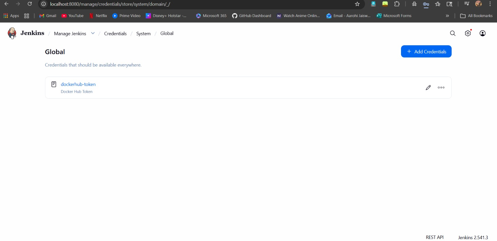

**2. Create Pipeline Job**
```
New Item → Pipeline
  Name: ci-cd-pipeline
  Pipeline script from SCM
  SCM: Git
  Repo URL: https://github.com/your-username/my-app.git
  Script Path: Jenkinsfile
```
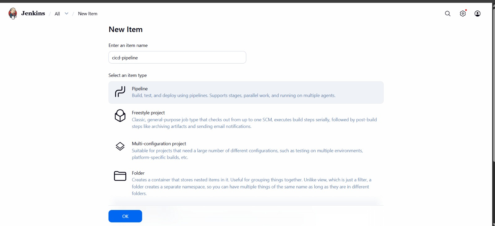
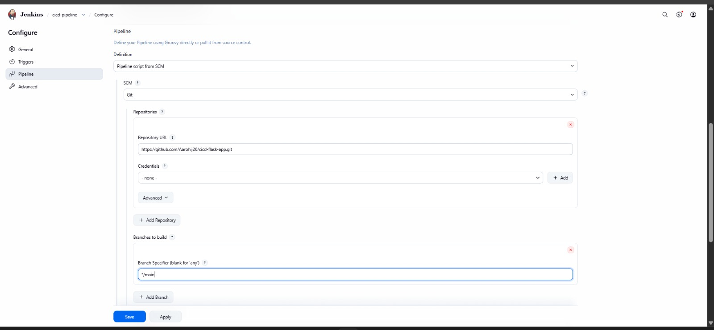

---

### Part D: GitHub Webhook

```
GitHub Repo → Settings → Webhooks → Add Webhook
  Payload URL: http://<your-server-ip>:8080/github-webhook/
  Events: Push events
```

---

## Pipeline Execution Flow

| Stage | Action |
|-------|--------|
| **Code Push** | Developer pushes code to GitHub |
| **Webhook Trigger** | GitHub notifies Jenkins automatically |
| **Clone** | Jenkins pulls latest code |
| **Build** | Docker builds the image using `Dockerfile` |
| **Auth** | Jenkins injects Docker Hub token securely |
| **Push** | Image is pushed to Docker Hub |
| **Done** | Image available globally on Docker Hub |

---

## Understanding `withCredentials`

The `withCredentials` block securely injects stored secrets as temporary environment variables — the secret never appears in plain text in your code or logs.

```groovy
withCredentials([string(credentialsId: 'dockerhub-token', variable: 'DOCKER_TOKEN')]) {
    sh 'echo $DOCKER_TOKEN | docker login -u your-username --password-stdin'
}
```

| Part | Meaning |
|------|---------|
| `string` | Type of secret (plain text token) |
| `credentialsId` | ID used when saving secret in Jenkins |
| `variable` | Temporary env variable name inside the block |

> ⚠️ `$DOCKER_TOKEN` is only accessible **inside** the `withCredentials` block — it disappears after.

**Never do this:**
```groovy
sh 'docker login -u user -p mypassword'  // ❌ Hardcoded secret
```

---

## Key Notes

- Jenkins is GUI-based but pipelines are code-driven via `Jenkinsfile`
- Docker socket (`/var/run/docker.sock`) is mounted so Jenkins can control host Docker directly — no separate agent needed
- Always store secrets in Jenkins Credentials — never hardcode them
- Webhook makes the entire pipeline fully automatic on every push

---

## Observations

- Jenkins GUI simplifies CI/CD pipeline management
- GitHub acts as both source code host and pipeline definition store
- Docker ensures consistent, reproducible builds
- Webhook eliminates the need for manual pipeline triggers

---

## Result

Successfully implemented a complete CI/CD pipeline where:
- Source code and pipeline definition are maintained in GitHub
- Jenkins automatically detects changes via webhook
- Docker image is built on the host agent
- Image is securely pushed to Docker Hub

---

## Viva Questions

1. What is the role of `Jenkinsfile`?
2. How does Jenkins integrate with GitHub?
3. Why is Docker used in CI/CD?
4. What is a webhook and how does it work?
5. Why store the Docker Hub token in Jenkins credentials instead of the `Jenkinsfile`?
6. What is the benefit of using the same host as the Jenkins agent?
